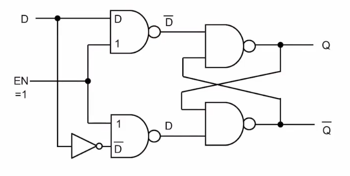
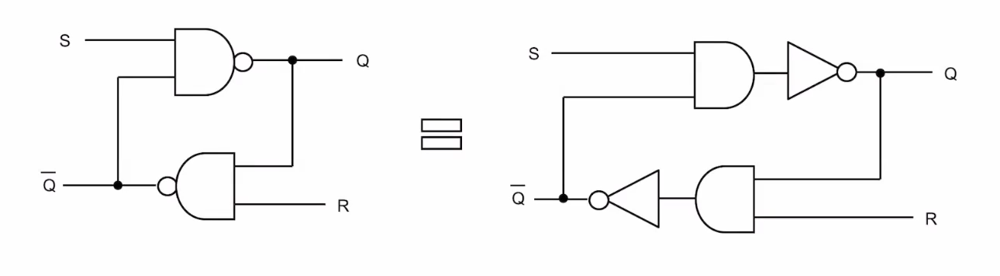
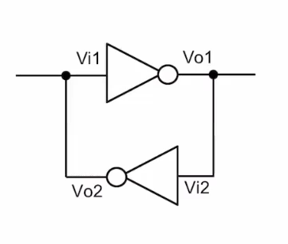
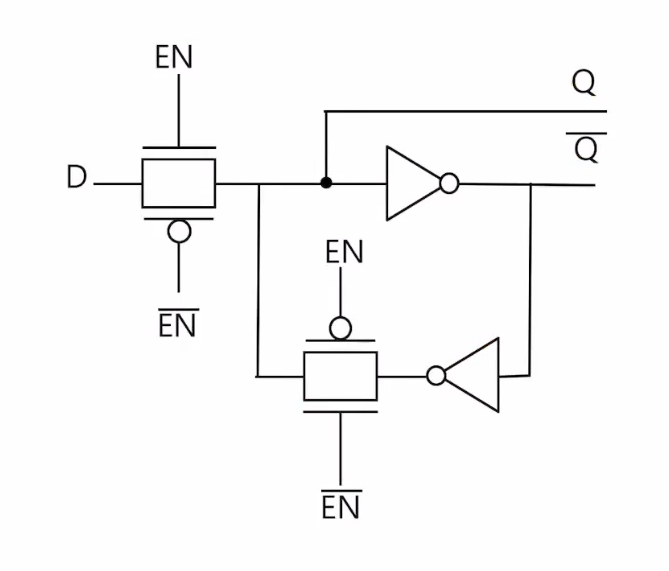

# 래치

## 조합회로와 순차회로의 구분

- 조합회로(Combinational logic)
  - 값을 저장하지 못함
  - 클럭을 사용하지 않음
  - 입력의 변화가 출력에 바로 반영됨
  - 예: adders, multiplexers, decoders, encoders, gates
- 순차 회로(Sequential logic)
  - 값을 저장하는 **래치**, **플립플롭**, **레지스터**, 메모리 등의 소자가 있어 상태를 저장
  - 클럭을 사용하여 값을 저장
  - 입력이 변화해도 주로 클럭의 에지에서 값이 반영됨
  - 예: counter, register, clock divider, FSM(Finite State Manchine)

## SR Latch

- SR(Set Reset) Latch

  - Set : S 신호가 0일 때 Q 값을 1로 만듦
  - Reset : R 신호가 0일 때 Q 값을 0으로 만듦
  - S, R 신호는 0일때 활성화되는 active-low 신호임

  - S = 0(active), R=1(inactive)일 때 Q=1 (set)
  - S = 1(inactive), R=0(active)일 때 Q=0, ~Q = 1 (reset)
  - S=1, R=1일 때 Q는 값을 유지
  - S=0, R=0는 입력되지 않도록 해야됨 
    - S=0, R=0일 때 Q=1, ~Q=1이지만 
    - S=1, R=1로 inactive 상태로 돌아왔을 때 Q가 어떤 값인지 불확실함

- Gated SR Latch

  - Enable(EN) 신호가 있는 SR Latch
    - SR Latch에 EN 신호를 추가한 Latch
    - EN = 0 : SR Latch 의 입력이 1, 1 이므로 값을 유지
    - EN= 1 : SR Latch의 입력이 ~S, ~R이 되어 출력값이 변할 수 있음(S, R 입력은 Active-high가 됨 : SR  latch와 반대)

## D Latch

- D latch
  - gated SR latch 의 입력을 묶어서 허용되지 않는 값이 없도록 만든 latch
  
  - 일반적으로 가장 많이 사용되는 latch
  
  - EN = 1일 때 Q는 입력 D를 그대로 출력하므로 transparent latch라고도 함
  
    

## Cross-coupled inverter

- Cross- coupled inverter는 bi-stable 회로로 2가지의 값을 안정적으로 저장
- SR latch도 cross-coupled inverter를 기본으로 하고 있음

- Vi1=Vo2=1, Vi2=Vo1=0 또는 Vi1=Vo2=0, Vi2=Vo1=1일 때 안정된 상태

### D latch

- D latch는 Cross-coupled inverter와 transmission gate 2개를 사용하여 만들 수 있음

