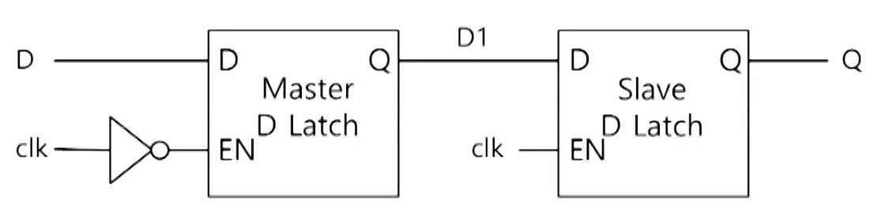

# 플립플롭(Flip-flop)

## Clock 신호

- clock 신호는 주기적인 square wave임
- clock 신호는 의미 있는 정보를 보낸다기 보다는 타이밍을 맞추기 위해 사용
- Clock에 맞추어 latch 또는 플립플롭이 동시에 정보를 저장

## 플립플롭

- 플립플롭(F/F)은 Clock 신호가 변화하는 시점인 엣지(Edge)에 맞추어 동작 (Edge-sensitive)

  (latch는 clock 신호 값의 수준에 맞추어 동작 (Level-sensitive))

- Rising edge에 맞추어 동작하는 F/F를 rising edge triggered F/F
- Falling edge에 맞추어 동작하는 F/F를 falling edge triggered F/F

### Classical D F/F

- 전통적인 구조의 rising edge-triggered D F/F
- C=0이면 S=1과 R =1이므로 Q와 ~Q는 값을 유지
- C=0에서 C=1이 되고 이 때 D=0이라면 오른쪽 SR 래치에서 S=1, R=0이 입력되어 Q=0이 됨
- 따라서 C=0에서 C=1이 되는 순간(rising edge)에 D=0의 값을 받아 Q=0이 됨

 

###  Edge-triggered D F/F

- Edge-triggered D F/F = Pulse transition detector + D Latch
  - Pulse transition detector 가 아주 짧은 시간만 D Latch의 EN = 1로 하므로 마치 edge 에 값을 받아들이는 동작의 효과를 냄 

- Pulse transition detector 회로
  - 신호가 inverter를 통과할 때의 지연시간을 이용하여 짧은 시간 동안만 1이 되는 일종의 glitch(spike)를 발생시킴 
  - 아주 짧은 펄수 동안만 D latch의 EN이 1이 됨

### Master-slave D F/F

- 앞의 2가지 D F/F과 동작이 같음
- 2개의 D latch를 사용하여 구성

### JK F/F

- JK F/F은 특히 카운터를 만들 때 유용하게 사용 가능

### T F/F

- T F/F은 JK F/F의 입력 J와 K를 연결하여 T 입력으로 함

### 비동기 리셋 D F/F

- 동기(Synchronous)
  - 클럭 신호에 맞추어 값이 변할 경우
- 비동기(Asynchronous)
  - 클럭 신호와 상관 없이 값이 변할 경우 

## 플립플롭 동작 특성

- propagation delay time : 전달(전파) 지연 시간
  - Clock의 edge로부터 값이 출력되기까지의 시간 
  - 신호가 변화하는 기울기가 무한대가 아님 

### 셋업(setup)과 홀드(hold) 시간

- Setup time : Clock의 edge 전 미리 입력 데이터가 안정되어야 하는 최소 시간
- Hold time : Clock의 edge 후 입력 데이터가 유지되고 있어야 하는 최소 시간 

 